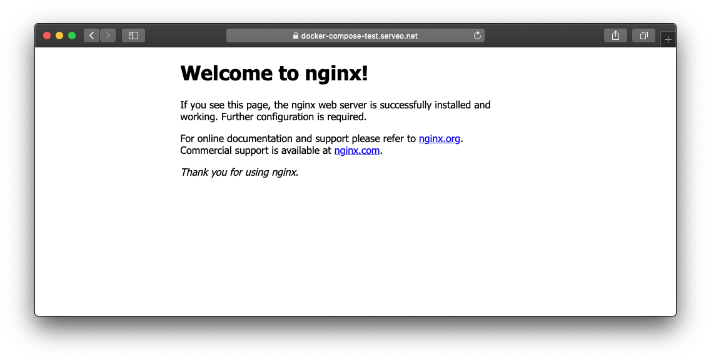

# Docker Serveo

A container to tunnel a local service to the internet using serveo.net.

## Usage

```console
$ docker run --rm -ti \
  -e LOCAL_HOST=myhostname.local \
  -e LOCAL_PORT=8080 \
  -e DOMAIN=docker-test \
  jacobtomlinson/serveo
```

Now http://myhostname.local:8080 will be available at https://docker-test.serveo.net.

## Full configuration

| Environment Variable  | Default | Description |
| ------------- | ------------- | ------------- |
| `LOCAL_HOST` | `0.0.0.0` | The local hostname that is running the service. |
| `LOCAL_PORT` | `8080` | The local post the service is running on. |
| `REMOTE_PORT` | `80` | The port for serveo to run the remote service on. This will automatically be upgraded to https. |
| `DOMAIN` | `''` | Your custom specified subdomain, defaults to a random subdomain. <br /><br />_You can also set up custom domains, see http://serveo.net for information._ |
| `SERVEO_HOST` | `serveo.net` | The serveo service to use (useful is self hosting). |
| `SERVER_ALIVE_INTERVAL` | `30` | The amount of time that [autossh](https://linux.die.net/man/1/autossh) should wait when polling to check your ssh connection to serveo is active. |
| `SERVER_ALIVE_COUNT_MAX` | `3` | The number of failed polls to wait before restarting the ssh connection. |

## Further examples

### Docker Compose

The following `docker-compose.yml` will create an nginx web server and expose it at https://docker-compose-test.serveo.net.

```yaml
version: "3"
services:
  web:
    image: nginx
  serveo:
    image: jacobtomlinson/serveo:latest
    environment:
      LOCAL_HOST: web
      LOCAL_PORT: 80
      DOMAIN: docker-compose-test
```

You can run the example like this.

```console
$ cd examples
$ docker-compose up
```


